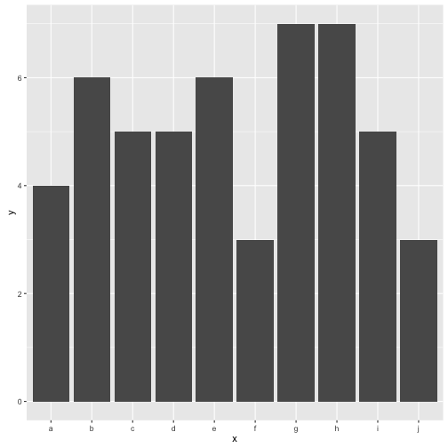
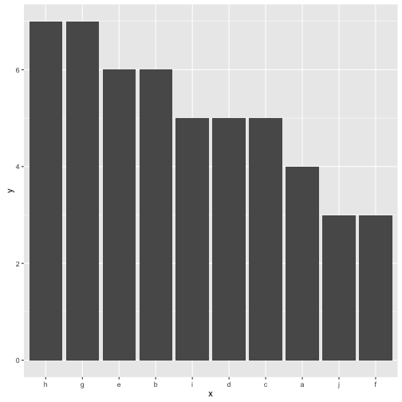

# Ordered

I got tired of fiddling around with manually setting factor levels, so I made this set of convenience functions to set factor levels. This is particularity useful when you are working in ggplot and want your categories in the right order. 

## Installation


```r
# install.packages("devtools")
devtools::install_github("mhairi/ordered")

library(ordered)
```

## Functions

There's currently three functions in the package. 

### order_by

First argument is the factor you want to order, second is the order of the elements of your factor.


```r
order_by(letters[c(1,1,2,3,3)], c(1,1,2,3,3))
```

```
## [1] a a b c c
## Levels: a < b < c
```
Won't let you order if you don't have a 1-1 relationship between the order and the elements. (Each element can only have one order).

### order_by_summary

Possibly more useful. First argument is the factor you want to order, the second is some attribute that you summarise to find the order.


```r
factor = c('a', 'a', 'b', 'b')
order = c(10, 12, 4, 5)
order_by_summary(factor, order, mean)
```

```
## [1] a a b b
## Levels: b < a
```

### order_by_number

I often find myself working with numbered factor variables, which have a natural order in the numbers in them. 


```r
f <- c('group_1', 'group_2', 'group_3')
order_by_number(f)
```

```
## [1] group_1 group_2 group_3
## Levels: group_1 < group_2 < group_3
```

## When is this useful?

I mainly use this for making bar graphs in `ggplot2`!

By default `ggplot2` orders your factors in alphabetic order. Which is sometimes fine.


```r
library(ordered)
library(ggplot2)

df <- data.frame(x = letters[1:10], y = rpois(10, 5))

ggplot(df) +
  aes(x = x, y = y) +
  geom_bar(stat = 'identity')
```



But quite often I find it clearer to have them ordered by the size of the bar.


```r
df$x <- order_by(df$x, df$y, desc = TRUE)

ggplot(df) +
  aes(x = x, y = y) +
  geom_bar(stat = 'identity')
```




